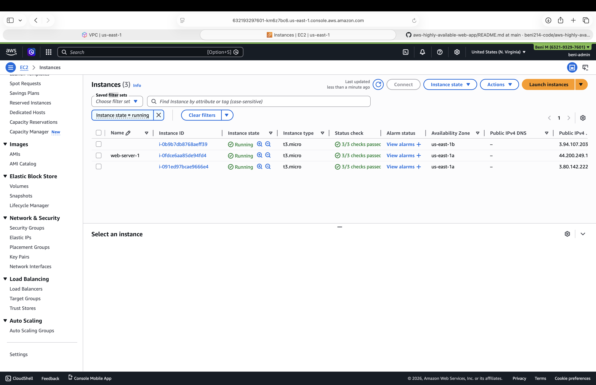
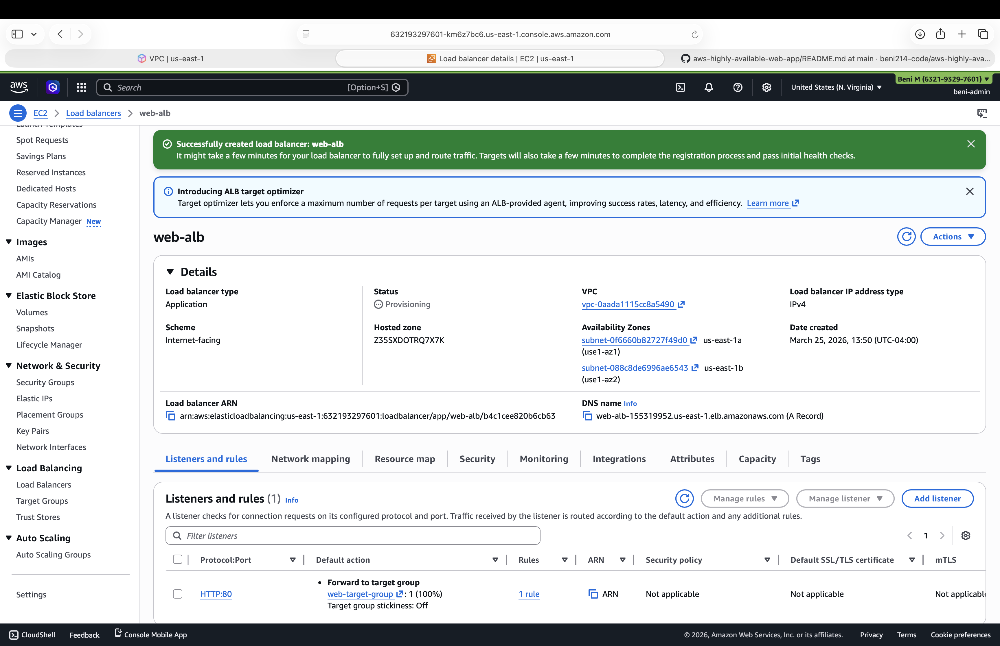
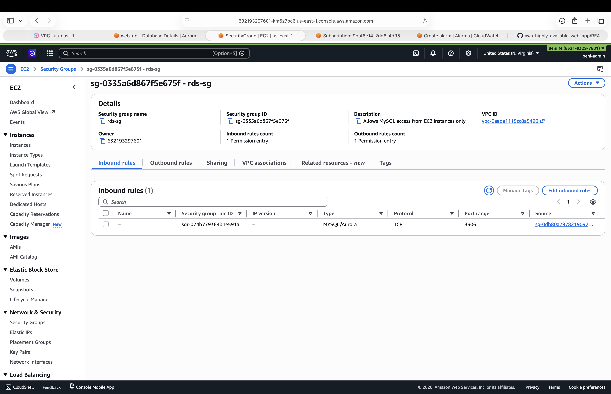
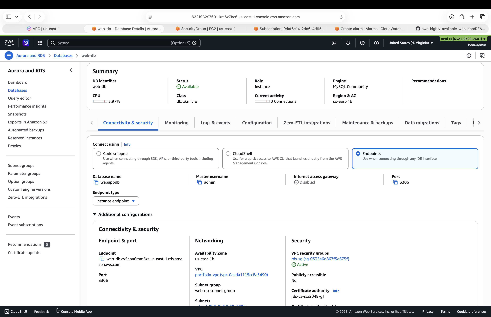
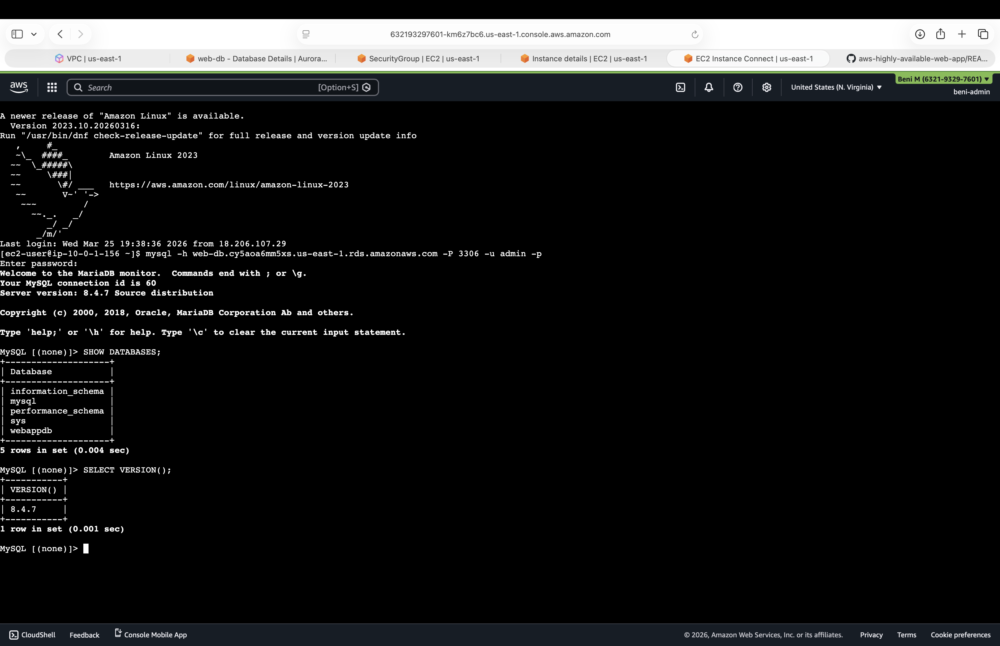
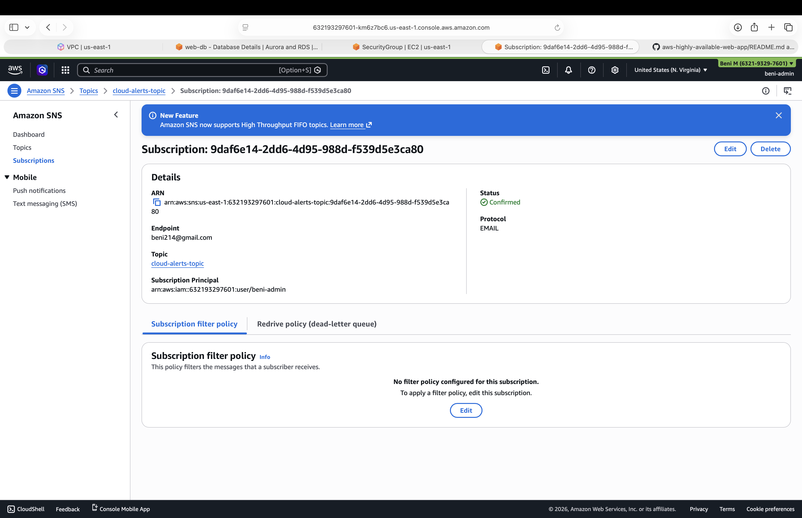

# Highly Available AWS Web Application Architecture

## Project Overview

This project demonstrates the deployment of a highly available and secure web application architecture on AWS using core infrastructure and monitoring services. The environment was designed to reflect real-world cloud engineering practices, including load balancing, private database design, controlled network access, and system monitoring.

The architecture emphasizes scalability, availability, security, and observability—key principles required in production-grade cloud environments.

---

## Architecture Summary

The system is designed to separate public-facing traffic from backend services while maintaining high availability and secure communication between components.

### Architecture Flow

- Users access the application through an **Application Load Balancer**
- Traffic is distributed across **multiple EC2 instances**
- EC2 instances connect to a **private RDS MySQL database**
- Database access is restricted using **Security Groups (port 3306)**
- **CloudWatch alarms** monitor system health
- **SNS email notifications** are triggered for alerts

---

## AWS Services Used

- **Amazon EC2** — Compute layer for hosting the application
- **Application Load Balancer (ALB)** — Traffic distribution across instances
- **Amazon RDS (MySQL)** — Managed relational database
- **Security Groups** — Network-level access control
- **Amazon CloudWatch** — Monitoring and alerting
- **Amazon SNS** — Notification service for alerts

---

## Key Features

- Highly available architecture using multiple EC2 instances
- Load-balanced traffic distribution via Application Load Balancer
- Private RDS database (not publicly accessible)
- Secure database access restricted to EC2 via port 3306
- Successful EC2-to-RDS connectivity validated using MySQL queries
- Monitoring and alerting configured using CloudWatch and SNS
- Clear separation between public and private infrastructure layers

---

## High-Level Implementation Steps

1. **Provisioned EC2 Instances**  
   Created multiple EC2 instances to support a scalable and resilient application layer.

2. **Configured Application Load Balancer**  
   Set up an internet-facing ALB to distribute traffic across EC2 instances.

3. **Deployed Private RDS MySQL Database**  
   Created an RDS instance with public accessibility disabled.

4. **Configured Security Groups**  
   Allowed MySQL (port 3306) access only from EC2 instances, following least-privilege principles.

5. **Validated Database Connectivity**  
   Connected from EC2 to RDS using MySQL and executed queries to confirm successful communication.

6. **Implemented Monitoring and Alerts**  
   Configured CloudWatch alarms and SNS email notifications for operational visibility.

---

## Screenshots

### 1. EC2 Instances Running
Shows multiple EC2 instances provisioned and active across availability zones for high availability.

---

### 2. Application Load Balancer
Shows the Application Load Balancer configured to distribute traffic across EC2 instances.

---

### 3. RDS Security Group Configuration
Shows the RDS security group allowing MySQL (port 3306) access only from EC2 instances.

---

### 4. RDS MySQL Instance
Shows the RDS MySQL instance configured with a private endpoint and not publicly accessible.

---

### 5. EC2 to RDS Connection Validation
Shows a successful MySQL connection from EC2 to RDS, including query execution.

---

### 6. SNS Alerts Configuration
Shows an SNS email subscription configured for CloudWatch alarm notifications.

---

## Skills Demonstrated

- AWS infrastructure deployment and configuration
- High availability architecture design
- Load balancing and traffic routing
- Secure database architecture (private RDS)
- Network security using Security Groups
- EC2 to RDS connectivity validation
- Cloud monitoring and alerting
- End-to-end system design thinking

---

## What I Learned

This project reinforced my understanding of how AWS services work together in a real-world architecture. I gained hands-on experience designing for availability, securing backend resources, validating service connectivity, and implementing monitoring for system reliability.

It also highlighted the importance of moving beyond simply deploying resources to building infrastructure with intentional design decisions around security, scalability, and maintainability.

---

## Why This Project Matters

This project demonstrates the ability to design and implement a production-style AWS architecture, including:

- Building resilient and highly available systems
- Securing backend services within a private network
- Validating application-to-database communication
- Implementing monitoring and alerting for operational awareness

It reflects practical cloud engineering skills applicable to real-world environments.
